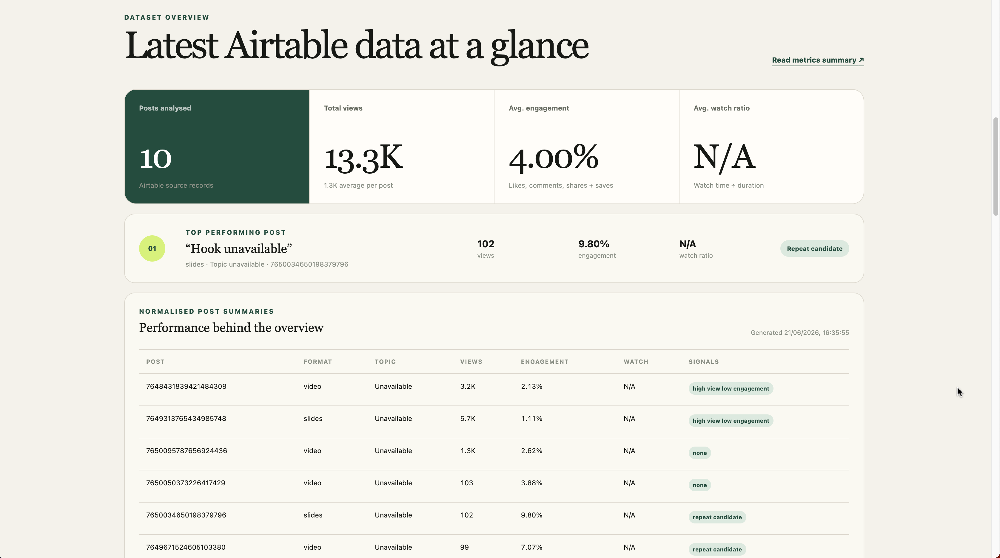
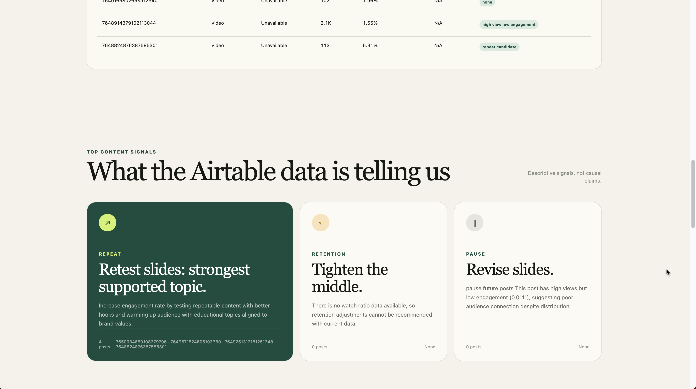

# TikTok Content Agent

An offline-first, AI-ready TikTok content strategy pipeline for small direct-to-consumer (DTC) brands.

It turns recent TikTok post performance data into transparent metrics, a readable summary, and a reviewable content plan. CSV and the manual strategy provider remain fully offline; Airtable, OpenAI, and Claude integrations are opt-in.

## Dashboard overview


The dashboard is a lightweight local review interface for the latest pipeline run. It reads from `outputs/latest/dashboard_data.json`, which is generated by the backend after running the CSV or Airtable pipeline.

The dashboard does not calculate metrics itself and does not silently mix sample data with real provider output. If no latest pipeline output exists, it shows a missing-output message and asks the user to run the backend pipeline first.

<details>
<summary>View more dashboard screenshots</summary>

### Latest Metrics overview



### Metrics and post summaries



### Strategy recommendation


### Script, caption, and hashtags


</details>

## Why this project exists

Small brands often publish on TikTok without a consistent feedback loop. They can see views, likes, comments, shares, saves, duration, and watch time, but those numbers do not automatically reveal what to test next.

This project explores a repeatable workflow between platform data, structured analysis, optional AI-assisted strategy, and human creative judgement.

The goal is not simply to automate content creation. It is to build a reliable, reviewable feedback loop between platform data, AI-assisted reasoning, and human creative decision-making.

## Current status

The offline MVP is working.

It currently:

* reads synthetic recent-post data from CSV
* optionally reads authorised Airtable records using canonical field names
* validates and normalises a documented canonical TikTok post schema
* calculates like, comment, share, save, engagement, watch, and optional region metrics
* compares performance by format and topic when those fields are available
* assigns deterministic, explainable performance signals
* exports `metrics_summary.md`
* exports a versioned `content_plan.json`
* exports reviewable `script.md`, `caption.txt`, and `hashtags.txt` drafts
* generates strategy through deterministic rules in the `manual` provider
* supports opt-in `openai` and `claude` strategy providers with validated JSON
* generates `outputs/latest/dashboard_data.json` for the frontend dashboard
* includes a responsive static dashboard for reviewing the latest local pipeline output
* includes a Phase 6B analyst chat panel backed by a minimal FastAPI server
* includes an intentionally non-operational TikTok upload placeholder
* keeps CSV plus the manual provider as the default offline path

It does not upload to TikTok or provide image-generation, video-generation, scheduling, or automatic publishing features.

## How to use

Requirements:

* Python 3.10 or newer
* a virtual environment is recommended
* dependencies installed from `requirements.txt`

From the repository root, create and activate a virtual environment, then install the dependencies:

```
python3 -m venv venv
source venv/bin/activate
python3 -m pip install -r requirements.txt
```

### 1. CSV with the manual provider

This is the default offline demo. It requires no API keys and makes no network requests:

```
python3 -m src.backend.pipeline \
  --mode export_only \
  --source csv \
  --input examples/sample_recent_posts.csv \
  --limit 10 \
  --provider manual
```

### 2. Airtable with the manual provider

Copy `.env.example` to `.env` and configure:

```
AIRTABLE_API_KEY=replace_with_your_airtable_key
AIRTABLE_BASE_ID=replace_with_your_base_id
AIRTABLE_TABLE_ID=replace_with_your_table_id
AIRTABLE_VIEW_ID=replace_with_your_view_id
```

Then run:

```
python3 -m src.backend.pipeline \
  --mode export_only \
  --source airtable \
  --limit 10 \
  --provider manual
```

### 3. CSV with OpenAI

Add `OPENAI_API_KEY` and optionally `OPENAI_MODEL` to the ignored local `.env`:

```
OPENAI_API_KEY=replace_with_your_key
OPENAI_MODEL=gpt-4.1-mini
```

Then run:

```
python3 -m src.backend.pipeline \
  --mode export_only \
  --source csv \
  --input examples/sample_recent_posts.csv \
  --limit 10 \
  --provider openai
```

### 4. Airtable with OpenAI

Configure both the four `AIRTABLE_*` variables and `OPENAI_API_KEY`, then run:

```
python3 -m src.backend.pipeline \
  --mode export_only \
  --source airtable \
  --limit 10 \
  --provider openai
```

### 5. CSV or Airtable with Claude

Add `CLAUDE_API_KEY` and optionally `CLAUDE_MODEL` to `.env`:

```
CLAUDE_API_KEY=replace_with_your_key
CLAUDE_MODEL=claude-sonnet-4-5
```

Use `--provider claude` with either source:

```
python3 -m src.backend.pipeline \
  --mode export_only \
  --source airtable \
  --limit 10 \
  --provider claude
```

For CSV, change `--source airtable` to `--source csv` and add:

```
--input examples/sample_recent_posts.csv
```

Never commit `.env` or paste real keys into source files, documentation, logs, or issues.

## Available options

| Option         | Values or default                                 | Purpose                                           |
| -------------- | ------------------------------------------------- | ------------------------------------------------- |
| `--mode`       | `export_only`                                     | Generates local strategy files without publishing |
| `--source`     | `csv` or `airtable`; default `csv`                | Selects the analytics source                      |
| `--input`      | CSV file path                                     | Required only when `--source csv` is used         |
| `--limit`      | Integer; default `10`                             | Maximum number of posts to analyse                |
| `--provider`   | `manual`, `openai`, or `claude`; default `manual` | Selects the strategy provider                     |
| `--output-dir` | Default `outputs/demo`                            | Changes the generated-output directory            |

`MODEL_PROVIDER` may set the default provider when `--provider` is omitted. An explicit `--provider` option takes precedence.

View the built-in command help with:

```
python3 -m src.backend.pipeline --help
```

## Generated files

Every successful run creates strategy outputs in the selected output directory, for example:

```
outputs/demo/metrics_summary.md
outputs/demo/content_plan.json
outputs/demo/script.md
outputs/demo/caption.txt
outputs/demo/hashtags.txt
```

The pipeline also writes the latest frontend-friendly dashboard file:

```
outputs/latest/dashboard_data.json
```

Generated outputs are deliberately ignored by Git because real runs may contain private analytics or brand strategy.

The Airtable, OpenAI, and Claude integrations are opt-in and make network requests. Credentials and private source identifiers are not written to the generated reports. All strategy output remains a draft for human review.

## Frontend dashboard

After running the pipeline, start the FastAPI dashboard server from the
repository root:

```
python3 -m src.backend.server
```

Then open:

```
http://127.0.0.1:8000/
```

The dashboard reads the latest pipeline output through:

```
GET /api/dashboard-data
```

That endpoint reads only:

```
outputs/latest/dashboard_data.json
```

If that ignored file is absent or invalid, it shows a clear missing-output message instead of sample results.

Using a local server is recommended because browsers may block local file loading when opening the HTML file directly with `file://`.

The intended dashboard workflow is:

1. Run the backend pipeline.
2. Backend writes `outputs/latest/dashboard_data.json`.
3. Start the FastAPI server.
4. Open the frontend dashboard.
5. Review the same data and strategy outputs from that pipeline run.
6. Ask the analyst chat panel questions about the loaded run.

This avoids a misleading dashboard where sample data appears alongside real provider-generated recommendations.

Phase 6A was a small offline/manual browser analyst. Phase 6B moves the analyst
logic behind a minimal FastAPI backend so API keys stay server-side. The
frontend now posts analyst questions to:

```
POST /api/analyst-chat
```

The request body is:

```json
{
  "question": "Which posts performed best recently?",
  "provider": "manual"
}
```

Supported analyst providers are `manual`, `openai`, and `claude`. `manual` is
deterministic and offline. `openai` and `claude` are opt-in only, read keys from
the server environment or ignored local `.env`, and receive only compacted
`outputs/latest/dashboard_data.json` context. Analyst responses return
structured JSON with `summary`, `evidence`, `recommendation`,
`suggested_next_action`, `limitations`, `provider`, and `llm_called`.

## Airtable field requirements

The Airtable source should contain one record per TikTok post.

Mandatory fields are required for the core analytics pipeline. Optional fields improve reporting and strategy generation, but the pipeline should still run when they are missing.

### Mandatory fields

| Field                        | Type / format         | Meaning                                                                                                                    |
| ---------------------------- | --------------------- | -------------------------------------------------------------------------------------------------------------------------- |
| `post_id`                    | Text                  | Unique identifier for the TikTok post. This can be the TikTok video ID, Airtable record ID, or another stable internal ID. |
| `published_at`               | Date or datetime      | Date or datetime when the post was published. Recommended format: `YYYY-MM-DD` or ISO datetime.                            |
| `format`                     | Text or single select | Content format, such as `video`, `image_carousel`, `talking_head`, `product_demo`, or `educational`.                       |
| `views`                      | Integer               | Number of video or post views.                                                                                             |
| `likes`                      | Integer               | Number of likes.                                                                                                           |
| `comments`                   | Integer               | Number of comments.                                                                                                        |
| `shares`                     | Integer               | Number of shares.                                                                                                          |
| `saves`                      | Integer               | Number of saves or favourites. Use `0` if unavailable.                                                                     |
| `duration_seconds`           | Number                | Length of the video in seconds. For image posts, use `0` or leave blank if not applicable.                                 |
| `average_watch_time_seconds` | Number                | Average watch time in seconds. Leave blank if unavailable.                                                                 |
| `completion_rate`            | Decimal or percentage | Completion rate, for example `0.35` or `35%`. The loader should normalise supported formats.                               |

### Optional fields

| Field                 | Type / format                | Meaning                                                                                                                                                                                             |
| --------------------- | ---------------------------- | --------------------------------------------------------------------------------------------------------------------------------------------------------------------------------------------------- |
| `post_url`            | Text                         | Public TikTok post URL.                                                                                                                                                                             |
| `caption`             | Long text                    | Original TikTok caption.                                                                                                                                                                            |
| `topic`               | Text or single select        | Human-provided content topic label, such as `oily scalp`, `hard water`, `product education`, `hair shedding`, or `brand story`. This field is optional and should not be invented during ingestion. |
| `hook`                | Text                         | The opening hook or first-line idea of the post. This field is optional and should not be invented during ingestion.                                                                                |
| `top_region`          | Text                         | Main audience region for the post, such as `Australia`, `United Kingdom`, or `Bhutan`.                                                                                                              |
| `target_region_match` | Boolean, percentage, or text | Whether the post reached the intended audience region, depending on the Airtable setup.                                                                                                             |
| `notes`               | Long text                    | Internal notes about the post.                                                                                                                                                                      |

Important behaviour:

* Core metrics such as views, engagement rates, retention, and rule-based signals do not depend on `topic` or `hook`.
* If `topic` is missing, topic-level grouping should be skipped or marked as unavailable.
* If `hook` is missing, generated drafts should use a neutral fallback rather than inventing the original hook.
* Missing optional metadata should reduce reporting detail, not break the pipeline.
* LLM-based topic or hook inference should be treated as a future metadata enrichment phase, not part of Airtable ingestion.

## Example analysis

The synthetic dataset contains 10 fictional posts across formats and topics such as education, product demonstrations, founder stories, lifestyle, and behind-the-scenes content.

The generated Markdown report includes:

* posts analysed and total views
* average engagement rate
* average watch ratio
* top and weak post comparisons
* format and topic performance
* audience-region notes
* deterministic signals and next-test guidance
* a per-post metric appendix

The JSON file records the metrics and signals behind repeat, pause, and retention decisions. The text files are rendered from the selected content item, and every output requires human review before publishing.

## How it works

```
CSV (default) or Airtable (opt-in)
              |
              v
       Source ingestion
              |
              v
    Record normalisation
              |
              v
    Metrics calculation
              |
    +---------+---------+
    |                   |
    v                   v
Metrics summary     Strategy provider
  Markdown          manual / OpenAI / Claude
    |                   |
    +---------+---------+
              |
              v
      Generated outputs
              |
              v
   outputs/latest/dashboard_data.json
              |
              v
      FastAPI server
              |
              v
      Static dashboard + analyst chat
```

The backend owns ingestion, validation, metrics, strategy generation, export,
and analyst chat. The frontend presents the latest local pipeline output from
`outputs/latest/dashboard_data.json`; it does not calculate metrics or
independently mix sample data with real provider output. Analyst chat answers
are grounded in that same dashboard JSON.

## Metrics

The MVP calculates:

```
like_rate           = likes / views
comment_rate        = comments / views
share_rate          = shares / views
save_rate           = saves / views, when saves are available
engagement_rate     = (likes + comments + shares + available saves) / views
average_watch_ratio = average watch time / duration
region_match_score  = top-region share when target matches, otherwise its remainder
```

Zero-view records receive zero-valued rate metrics. Missing optional values are kept missing rather than invented.

These metrics are descriptive, not causal. They support creative testing but do not guarantee future performance.

The canonical fields, validation rules, region-score limitation, and signal thresholds are documented in `docs/canonical-schema.md`.

## Repository structure

```
AGENTS.md                  Coding-agent project rules
README.md                  Public project overview
docs/
  assets/                  Public README images and roadmap visuals
  current-checkpoint.md     Latest verified state and safe continuation notes
  project-brief.md         Product goal, users, scope, and non-goals
  CONTEXT.md               Business context and operating assumptions
  architecture.md          Data flow, boundaries, and security model
  canonical-schema.md      Input fields, calculated metrics, and signal rules
  content-plan-schema.md   Strategy output schema
  setup-notes.md           Local setup and future CI plan
examples/
  sample_recent_posts.csv  Synthetic public demo data
prompts/                   Provider prompt templates
src/backend/               Python pipeline and provider boundaries
src/frontend/              Static dashboard for latest local pipeline results
tests/                     Offline automated tests
data/raw/                  Ignored private source data
data/processed/            Ignored private transformed data
outputs/                   Ignored generated results
```

## Backend design

The Python backend separates:

* CSV and optional Airtable ingestion
* record normalisation
* metric calculation and aggregation
* Markdown and JSON export
* provider selection and strategy generation
* future publishing boundaries

The current `manual` provider deterministically selects a repeat candidate, records pause and retention guidance, and drafts one script, caption, and hashtag set.

The `openai` and `claude` providers are explicitly selected, send only a compact metrics and signal payload, validate returned JSON, and require human review.

## Frontend design

The frontend is a static HTML/CSS/JavaScript dashboard under `src/frontend/`.

It displays:

* source and provider metadata
* dataset overview
* recent post metrics
* performance summaries
* content recommendations
* generated scripts
* captions and hashtags
* human review notes
* local analyst-chat answers based on the latest dashboard payload

The frontend is intentionally lightweight. It does not require React, Vite,
Next.js, authentication, or a database. Phase 6B uses a minimal FastAPI server
only for latest-data access and analyst chat.

It reads the single latest result through the FastAPI API, which loads:

```
outputs/latest/dashboard_data.json
```

If that file does not exist, the page asks the user to run the pipeline first.

## Human review

The intended workflow keeps a person in control:

1. Collect recent performance data.
2. Calculate transparent metrics.
3. Generate a summary and recommendation.
4. Review facts, creative direction, tone, visuals, and compliance.
5. Edit or approve any generated assets.
6. Make the final publishing decision.

TikTok authentication, scheduling, and publishing are deliberately outside the MVP.

## Privacy and security

This is a public portfolio repository.

* All committed example records are fictional.
* `.env`, generated outputs, raw data, processed data, and logs are ignored.
* `.env.example` contains placeholders only.
* Real analytics and generated plans must stay in ignored local directories.
* The sample command uses no credentials and performs no network calls.
* Airtable, OpenAI, and Claude integrations are explicitly selected and do not log secrets.
* Generated dashboard data under `outputs/` should remain local and ignored.
* Any future publishing workflow must require authentication, consent, review, and auditable actions.

Do not commit:

* `.env`
* API keys
* Airtable credentials
* raw Airtable API responses
* private TikTok analytics exports
* private generated strategy outputs
* local certificate paths
* virtual environment files

## Configuration

No environment variables are required for the default CSV path.

Optional Airtable ingestion requires:

```
AIRTABLE_API_KEY
AIRTABLE_BASE_ID
AIRTABLE_TABLE_ID
AIRTABLE_VIEW_ID
```

Optional OpenAI strategy generation requires:

```
OPENAI_API_KEY
OPENAI_MODEL
```

Optional Claude strategy generation requires:

```
CLAUDE_API_KEY
CLAUDE_MODEL
```

Never commit local values.

If environment variables are stored in `.env`, load them before running commands if the pipeline does not load them automatically:

```
set -a
source .env
set +a
```

## Troubleshooting: provider API connection issues

If OpenAI or Claude works in one terminal session but fails in another, the issue may be local environment configuration rather than the provider itself.

A virtual environment does not automatically copy every environment variable from another terminal session. API keys, model names, proxy settings, and SSL certificate paths may need to be loaded again.

First check that the local `.env` values are loaded:

```
python3 -c "import os; print('OPENAI_KEY', bool(os.getenv('OPENAI_API_KEY'))); print('OPENAI_MODEL', os.getenv('OPENAI_MODEL'))"
```

If the key is missing, reload the local `.env` file:

```
set -a
source .env
set +a
```

A basic reachability check can show whether the machine can contact the provider edge server:

```
curl -I https://api.openai.com
curl -I https://api.airtable.com
```

A successful `curl` response only proves network reachability. It does not prove that the API key, model name, SDK version, request payload, or project permissions are correct.

To compare SSL or proxy settings between a working terminal and a failing terminal, run:

```
echo $SSL_CERT_FILE
echo $REQUESTS_CA_BUNDLE
echo $CURL_CA_BUNDLE
echo $HTTP_PROXY
echo $HTTPS_PROXY
python3 -c "import certifi; print(certifi.where())"
python3 -c "import ssl; print(ssl.get_default_verify_paths())"
```

If HTTPS provider calls fail because of local certificate verification, try setting the certificate bundle from `certifi`:

```
export SSL_CERT_FILE=$(python3 -c "import certifi; print(certifi.where())")
export REQUESTS_CA_BUNDLE=$(python3 -c "import certifi; print(certifi.where())")
```

Do not hardcode local certificate paths into application code, and do not commit local environment fixes.

## Tests

Run the offline test suite:

```
python3 -m unittest discover -v
```

Then exercise the public CLI:

```
python3 -m src.backend.pipeline \
  --mode export_only \
  --source csv \
  --input examples/sample_recent_posts.csv \
  --limit 10 \
  --provider manual
```

The default tests must remain independent of paid APIs and repository secrets.

## Roadmap

Planned next steps:

1. Add further authorised export adapters.
2. Expose results through a small backend API.
3. Add GitHub Actions for offline tests, JSON validation, and secret scanning.
4. Design a separate, human-reviewed TikTok draft workflow.
5. Keep publishing, scheduling, and media generation as separate future phases.

Private workflow outputs should be stored as protected artifacts or in private storage, not committed to this repository.

The phased product plan prioritises stronger analytics and deterministic strategy before external APIs, media generation, or publishing integrations.

See the full project roadmap in `docs/roadmap.md`.

## Portfolio focus

This project demonstrates:

* modular backend pipeline design
* data normalisation and metric calculation
* deterministic offline fallbacks
* LLM-ready summarisation and provider abstraction
* Airtable ingestion with documented field requirements
* provider-based OpenAI and Claude strategy generation
* privacy-aware repository architecture
* frontend/backend separation
* dashboard output consistency
* human-in-the-loop system design
* staged integration planning without overstating current capabilities

The goal is not to replace creative judgement. It is to build a reliable system that helps a small brand learn from recent content performance, decide what to test next, and review AI-assisted drafts before publishing.

See `docs/project-brief.md`, `docs/CONTEXT.md`, and `docs/architecture.md` for deeper detail.
