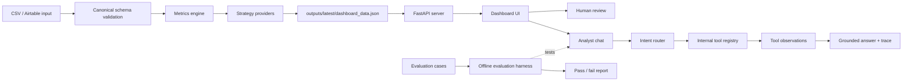

# TikTok Content Agent

A local-first AI content intelligence system for analysing TikTok content
performance, generating reviewable strategy recommendations, and testing a
tool-grounded analyst workflow.

The project ingests recent TikTok post performance data from CSV, with optional
Airtable ingestion, validates it against a canonical schema, calculates metrics
and rule-based performance signals, and writes a dashboard-ready payload to
`outputs/latest/dashboard_data.json`.

A local FastAPI server and static dashboard use that same payload for review.
The analyst chat answers natural-language questions through deterministic
internal tools, returning evidence, limitations, and a safe ReAct-like
tool-use trace. An offline evaluation harness checks expected tool use,
response schema, grounding, limitations, and no-LLM behaviour for the manual
provider.

The default path is fully offline and deterministic. OpenAI and Claude are
optional provider boundaries, not required for the demo or evaluation harness.


## What It Does

- Loads synthetic CSV data, or authorised Airtable records when configured.
- Normalises posts into a documented TikTok performance schema.
- Calculates views, engagement, watch, save, share, comment, and region metrics.
- Assigns deterministic repeat, pause, retention, and distribution signals.
- Generates `metrics_summary.md`, `content_plan.json`, `script.md`,
  `caption.txt`, and `hashtags.txt` for human review.
- Writes `outputs/latest/dashboard_data.json` as the shared grounding source.
- Serves a local dashboard and analyst chat through FastAPI.
- Evaluates analyst behaviour offline with fixture-based cases.

It does not upload to TikTok, schedule posts, generate media, run background
jobs, or operate as a production SaaS product.

## Architecture



`outputs/latest/dashboard_data.json` is the shared grounding source. The
dashboard and analyst chat both read from it, and the analyst tools operate only
over that safe structured payload. The evaluation harness tests analyst
behaviour without calling OpenAI, Claude, Airtable, TikTok, or any other
external API.


## AI Engineering Concepts Demonstrated

| Concept | How this project demonstrates it |
| --- | --- |
| Data grounding | Analyst answers are grounded in `outputs/latest/dashboard_data.json`, not arbitrary chat context. |
| Canonical schema validation | TikTok records are validated and normalised before metrics or strategy generation. |
| LLM provider boundary | `manual`, `openai`, and `claude` share provider contracts; `manual` remains deterministic and offline. |
| Tool calling | Analyst questions map to deterministic Python tools such as `get_top_posts` and `get_retention_issues`. |
| ReAct-like trace | Responses can include interpreted intent, tools used, observations, and limitations without exposing hidden chain-of-thought. |
| Structured outputs | Strategy plans, analyst answers, dashboard data, and eval reports use predictable fields. |
| Evaluation harness | Offline cases verify expected tool use, evidence, limitations, response schema, and `llm_called=false`. |
| Human-in-the-loop design | Generated scripts, captions, hashtags, and recommendations are drafts for review. |
| Safety and privacy boundary | Real analytics, generated outputs, logs, and credentials stay in ignored local paths. |
| Full-stack integration | Python pipeline, FastAPI endpoints, static dashboard, analyst tools, and tests work from one local payload. |

## How To Run Locally

Requirements:

- Python 3.10 or newer
- dependencies from `requirements.txt`
- no API keys for the default CSV/manual path

```bash
python3 -m venv .venv
source .venv/bin/activate
python3 -m pip install -r requirements.txt
```

Run the offline sample pipeline:

```bash
python3 -m src.backend.pipeline \
  --mode export_only \
  --source csv \
  --input examples/sample_recent_posts.csv \
  --limit 10 \
  --provider manual
```

Start the local dashboard server:

```bash
python3 -m src.backend.server
```

Open:

```text
http://127.0.0.1:8000/
```

Run tests:

```bash
python3 -m unittest discover -v
```

Run the analyst evaluation harness:

```bash
python3 -m src.backend.evaluate_analyst
```

Optional Airtable, OpenAI, and Claude setup is documented in
`docs/setup-notes.md`. Use `.env.example` for placeholder variable names only;
never commit real credentials.

## Analyst Chat

The dashboard sends analyst questions to:

```text
POST /api/analyst-chat
```

Example request:

```json
{
  "question": "Which posts performed best recently?",
  "provider": "manual"
}
```

Analyst responses include:

- `summary`
- `evidence`
- `recommendation`
- `suggested_next_action`
- `limitations`
- `provider`
- `llm_called`
- optional `trace`

Current manual-mode questions cover:

- Which posts performed best recently?
- Which hook should I reuse?
- What should I avoid or pause?
- How should I improve retention?
- Why are some posts stuck around 90 views?
- Give me the general summary.

Unsupported diagnostic questions return limitations when the dashboard data
lacks required fields such as impressions, traffic source, follower split,
audio trend data, or detailed retention curves. Exact threshold filters such as
"What patterns appear in posts over 1000 views?" are a future analyst-routing
extension unless mapped to a supported tool path.

## Internal Analyst Tools

The current deterministic analyst tools are:

- `get_dashboard_summary`
- `get_top_posts`
- `get_underperforming_posts`
- `get_repeat_candidates`
- `get_pause_candidates`
- `get_retention_issues`
- `compare_posts_by_metric`

These are ordinary Python functions over dashboard data. They do not call
external APIs, do not use hidden browser state, and do not require an LLM. This
makes the analyst flow easier to test now, while leaving room for future LLM
planners to reuse the same tool registry.

## ReAct-Like Tool-Use Trace

Manual analyst responses may include a safe, user-visible trace:

```json
{
  "interpreted_intent": "best_performing_posts",
  "tools_used": ["get_top_posts"],
  "observations": [
    "demo-004 had the highest engagement rate among the loaded posts."
  ],
  "limitations": [
    "Grounded only in outputs/latest/dashboard_data.json."
  ]
}
```

The trace records how an answer was grounded: interpreted intent, tools used,
short factual observations, and limitations. It is not hidden chain-of-thought.

## Offline Analyst Evaluation

The eval runner loads synthetic fixtures from `tests/fixtures/` and runs
representative questions through the manual analyst provider:

```bash
python3 -m src.backend.evaluate_analyst
```

It checks:

- required response fields
- expected interpreted intent
- expected tools used
- non-empty evidence and limitations
- limitation keywords for unsupported diagnostic questions
- short factual trace observations
- `provider == "manual"`
- `llm_called == false`

This is a deterministic regression check and portfolio demonstration, not a
benchmark of model quality.

## Generated Outputs

The sample pipeline writes ignored local files:

```text
outputs/demo/metrics_summary.md
outputs/demo/content_plan.json
outputs/demo/script.md
outputs/demo/caption.txt
outputs/demo/hashtags.txt
outputs/latest/dashboard_data.json
```

Generated outputs are ignored because real runs may contain private analytics
or brand strategy.

## Repository Map

```text
src/backend/               Ingestion, normalisation, metrics, providers, API, analyst tools
src/frontend/              Static dashboard UI
tests/                     Offline unit tests and analyst eval fixtures
examples/                  Synthetic public sample data
docs/                      Architecture, setup, schema, roadmap, and handoff notes
prompts/                   Provider prompt templates
data/raw/                  Ignored private source data
data/processed/            Ignored private transformed data
outputs/                   Ignored generated reports and dashboard payloads
```

Useful docs:

- `docs/architecture.md` - module boundaries and data flow
- `docs/setup-notes.md` - setup, environment variables, and verification
- `docs/canonical-schema.md` - input fields, metrics, and signals
- `docs/content-plan-schema.md` - generated strategy plan schema
- `docs/current-checkpoint.md` - latest verified state for future work

## Scope And Non-Goals

In scope:

- local CSV demo
- optional authorised Airtable ingestion
- deterministic manual strategy provider
- optional OpenAI and Claude provider boundaries
- static dashboard and local FastAPI API
- manual analyst tool use and trace
- offline evaluation harness
- human review before publishing

Out of scope:

- production SaaS operation
- authentication, billing, tenancy, or deployment
- real TikTok API publishing
- automatic scheduling or direct upload
- image or video generation
- background jobs
- claims that metrics prove causation

The project is intentionally local-first: it demonstrates AI engineering
patterns without requiring live model calls for the default workflow.
