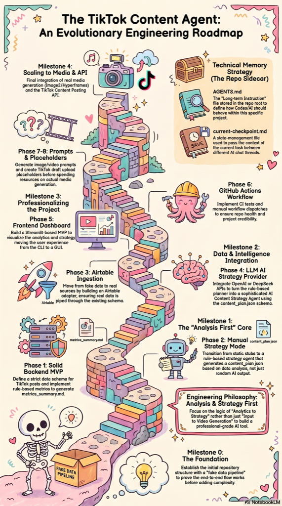

# Product Roadmap

This roadmap develops `tiktok-content-agent` from a working offline scaffold
into a credible, privacy-aware content strategy product.

The sequence is intentional: strengthen the analytics and strategy foundation
before adding external data sources, model providers, media generation, or
publishing integrations.

## Roadmap infographic



## Status legend

- **Completed** — implemented and verified
- **Next milestone** — the active priority for the next development cycle
- **Planned** — intentionally deferred until earlier phases are complete

## Phase 0 — Repository scaffold and offline demo

**Status: Completed**

### Goal

Establish a public, runnable MVP skeleton using synthetic data and no external
services.

### Completed capabilities

- Public repository structure and project documentation
- Synthetic TikTok post dataset under `examples/`
- Local CSV ingestion and record normalisation
- Basic engagement and watch metric calculation
- Markdown metrics summary generation
- Deterministic content-plan stub generation
- Manual strategy-provider boundary
- OpenAI and Claude provider interfaces
- Non-operational TikTok upload placeholder
- Static frontend placeholder
- Offline automated test
- Secret, private-data, and generated-output exclusions

### Verified flow

```text
examples/sample_recent_posts.csv
        |
        v
backend pipeline
        |
        +--> outputs/demo/metrics_summary.md
        |
        +--> outputs/demo/content_plan_stub.json
```

### Outcome

The project can read data, calculate metrics, export results, and run locally
without credentials, dependencies, network access, or external API calls.

---

## Phase 1 — Canonical schema and stronger analytics

**Status: Completed**

### Goal

Move the backend from a runnable demo to an engineering-credible analytics MVP
before introducing any external API.

### Completed work

#### 1. Canonical TikTok post schema

Define one internal record shape that all current and future data sources must
map into.

Implemented fields:

```text
post_id
platform
post_url
published_at
format
topic
hook
caption
duration_seconds
views
likes
comments
shares
saves
average_watch_time_seconds
completion_rate
top_region
target_region
top_region_view_percentage
notes
```

Update the synthetic CSV, loader, normalisation logic, tests, and documentation
to use the agreed schema.

#### 2. Stronger metric calculations

Retain and validate:

- like rate
- comment rate
- share rate
- save rate
- engagement rate
- average watch ratio

Added through the canonical schema:

- region match score
- format-level comparisons
- topic-level comparisons

#### 3. Rule-based performance signals

Added deterministic, explainable classifications:

- `high_view_low_engagement`
- `low_view_high_save`
- `good_hook_weak_retention`
- `wrong_region_distribution`
- `repeat_candidate`
- `pause_candidate`

Thresholds must be documented and testable. These signals must not be described
as causal findings.

#### 4. LLM-ready metrics summary

Evolved `metrics_summary.md` into a compact strategy input with:

```text
Dataset overview
Top-performing posts
Weak-performing posts
Format performance
Topic performance
Audience region notes
Signals for next content
Per-post metric appendix
```

The summary should reduce the need to send raw private records to a future
model provider.

### Constraints

- Do not call external APIs.
- Do not add Airtable, LLM, media-generation, or TikTok integrations.
- Keep `content_plan_stub.json` deterministic.
- Preserve the offline sample command.
- Keep all committed data synthetic.

### Deliverables

- Canonical schema documented and implemented
- Updated `examples/sample_recent_posts.csv`
- Updated loader and normalisation logic
- Stronger metrics and rule-based signals
- Improved `outputs/demo/metrics_summary.md`
- Deterministic `outputs/demo/content_plan_stub.json`
- Updated tests, README, and architecture documentation

### Exit criteria

- The sample pipeline succeeds offline.
- Canonical records are validated consistently.
- New metrics and signals have automated tests.
- The report clearly separates observations from hypotheses.
- Documentation matches the implemented schema and behaviour.

---

## Phase 2 — Rule-based manual strategy mode

**Status: Completed**

### Goal

Turn calculated metrics and signals into a useful, deterministic content plan
without using an LLM.

### Completed work

- Defined and documented a stable `content_plan.json` schema.
- Replaced the fixed stub with a rule-based manual strategy agent.
- Based repeat, pause, and retention recommendations on Phase 1 metrics and signals.
- Generated reviewable script, caption, and hashtag files from the plan.
- Kept all output deterministic, offline, and testable.

### Completed deliverables

```text
outputs/demo/content_plan.json
outputs/demo/script.md
outputs/demo/caption.txt
outputs/demo/hashtags.txt
```

### Exit criteria

- The same input always produces the same plan.
- Recommendation reasons point to transparent metrics or rules.
- Output conforms to a documented schema.
- Human review remains mandatory.

---

## Phase 3 — Optional Airtable ingestion

**Status: Implemented and verified offline**

### Goal

Introduce the first private real-world data source while keeping analytics and
strategy provider-independent.

### Planned work

- Add an Airtable ingestion adapter.
- Map Airtable fields into the canonical TikTok schema.
- Add a CLI source option while retaining CSV as the default.
- Read credentials only from environment variables.
- Provide clear missing-configuration errors.
- Keep real source and processed data out of Git.

### Planned deliverables

```text
src/backend/ingest/airtable_loader.py
.env.example updates
README.md updates
docs/setup-notes.md updates
```

### Exit criteria

- CSV mode still works without credentials.
- Airtable-specific field names do not leak into downstream logic.
- Tokens and private records are never logged or committed.
- No LLM API is required.

---

## Phase 4 — Optional LLM strategy providers

**Status: Planned**

### Goal

Add opt-in AI strategy generation while preserving the deterministic manual
fallback.

### Planned work

- Formalise the strategy-provider interface.
- Keep the manual provider operational.
- Add an OpenAI provider.
- Add a Claude API provider using the same adapter contract.
- Send a compact metrics summary, plan schema, brand context, and generation
  rules instead of unrestricted raw data.
- Validate provider output as structured JSON.
- Fail clearly without exporting strategy files when output is invalid.

### Planned deliverables

```text
src/backend/strategy/
src/backend/strategy/providers/
prompts/content_strategy.md
outputs/demo/content_plan.json
```

### Exit criteria

- Provider use is explicitly selected and never accidental.
- API keys come only from environment variables.
- Invalid output cannot overwrite a valid deterministic plan.
- No credentials or full private datasets appear in logs.

---

## Phase 5 — Frontend dashboard MVP

**Status: Planned**

### Goal

Present metrics and recommendations as a lightweight product experience rather
than a command-line-only demonstration.

### Planned work

- Extend the existing static HTML, CSS, and JavaScript frontend.
- Display sample metrics and a sample content plan.
- Show top and weak posts, recommendations, scripts, captions, and hashtags.
- Avoid authentication, databases, and real API connections.
- Add clear local preview instructions.

### Planned deliverables

```text
src/frontend/index.html
src/frontend/styles.css
src/frontend/app.js
examples/sample_content_plan.json
```

### Exit criteria

- The dashboard works locally with public synthetic data.
- Frontend code does not duplicate backend analysis logic.
- No framework is introduced unless interactive requirements justify it.

---

## Phase 6 — GitHub Actions and reproducible checks

**Status: Planned**

### Goal

Make the public repository behave like a maintainable engineering project.

### Planned work

- Add CI for pushes and pull requests.
- Run tests and the offline sample pipeline without secrets.
- Validate that expected outputs are created and JSON is valid.
- Add a manual `workflow_dispatch` pipeline.
- Upload generated demo results as workflow artifacts.
- Do not commit generated outputs back into the repository.

### Planned deliverables

```text
.github/workflows/ci.yml
.github/workflows/manual-pipeline.yml
```

### Exit criteria

- CI requires no paid API or repository secret.
- Failed tests or invalid output fail the workflow.
- Generated results are artifacts rather than commits.

---

## Phase 7 — Image and video prompt generation

**Status: Planned**

### Goal

Generate reviewable text prompts for future visual production without calling
image or video services.

### Planned work

- Read the stable content-plan schema.
- Generate image-carousel prompt structures.
- Generate a future video-model prompt.
- Keep all output text-only and deterministic where practical.

### Planned deliverables

```text
outputs/demo/image_prompts.json
outputs/demo/video_prompt.md
```

### Exit criteria

- No image or video API is called.
- Prompts remain editable and require human review.
- Visual generation remains downstream of the analytics-to-strategy loop.

---

## Phase 8 — TikTok draft payload design

**Status: Planned**

### Goal

Design and validate a publishing payload without connecting to TikTok.

### Planned work

- Add a publishing module that reads the content plan and optional media
  metadata.
- Generate a draft-oriented upload payload.
- Document unresolved authentication, consent, review, and API requirements.
- Keep all network publishing disabled.

### Planned deliverables

```text
src/backend/publishing/tiktok_draft_uploader.py
outputs/demo/tiktok_upload_payload.json
```

### Exit criteria

- The module generates payload data only.
- It cannot authenticate, upload, schedule, or publish.
- The architecture documentation clearly marks the integration as a
  placeholder.

---

## Phase 9 — Real media-generation integrations

**Status: Planned**

### Goal

Optionally connect approved image or video-generation providers after the
analytics, strategy, and prompt layers are stable.

### Planned work

- Select providers based on product requirements, cost, and output quality.
- Add explicit provider adapters and configuration.
- Preserve text-only prompt generation as a low-cost fallback.
- Add human review before generated media moves toward publishing.
- Define storage, privacy, retry, and cost-control policies.

### Exit criteria

- Integrations are opt-in and cost-controlled.
- Generated media is stored outside the public repository.
- Failures do not break the core offline analytics workflow.

---

## Phase 10 — Real TikTok draft integration

**Status: Planned**

### Goal

Integrate TikTok's supported content-posting flow only after all safety,
permission, and review requirements are understood.

### Planned work

- Register and configure an appropriate TikTok developer application.
- Implement OAuth, token storage, and required scopes.
- Implement draft upload rather than automatic public publishing by default.
- Add rate-limit, retry, expiry, and error handling.
- Require explicit user review and consent.
- Add auditability and safe test-account procedures.

### Exit criteria

- The integration complies with current TikTok platform requirements.
- Credentials and media remain private.
- Every publishing action is explicit, reviewable, and auditable.
- The offline CSV and manual strategy paths continue to work independently.

---

## Development order

The planned sequence is:

```text
0. Repository scaffold and offline demo                     Completed
1. Canonical schema and stronger analytics                  Completed
2. Rule-based manual strategy mode                          Completed
3. Optional Airtable ingestion                              Next milestone
4. Optional LLM strategy providers                          Planned
5. Frontend dashboard MVP                                   Planned
6. GitHub Actions and reproducible checks                   Planned
7. Image and video prompt generation                        Planned
8. TikTok draft payload design                              Planned
9. Real media-generation integrations                       Planned
10. Real TikTok draft integration                           Planned
```

Phases 1 and 2 are complete. Phase 3 is the next milestone; later provider,
media-generation, and publishing integrations remain deferred.
